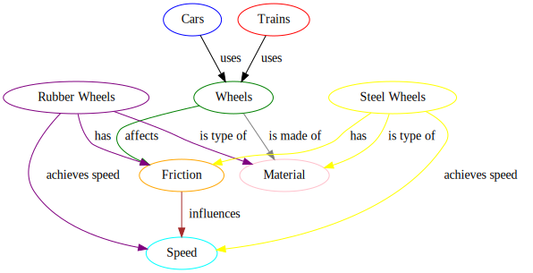

# Day 1 - Module 3: Exercises

These exercises are based on the concepts and code presented in Module 3: Handling Complex Data Structures (`src/03-complex-data/`).

## Exercise 3.1: Generating a Different Knowledge Graph

**Goal:** Practice using the LLM to generate structured knowledge graph output for a different topic.

Below is an example of the knowledge graph generated by the original script for the topic "relationship between cars, wheels and trains...". Your task is to modify the script to generate a similar graph for a different topic.



1.  Open the `src/03-complex-data/knowledge-graphs.py` script.
2.  Locate the line where `generate_graph` is called:
    ```python
    graph = generate_graph("What is the relationship between cars, wheels and trains...")
    ```
3.  Change the input string to a different topic that involves entities and relationships, for example: "Explain the main components of a simple web application: browser, web server, database, and how they interact."
4.  Run the script (`python3.11 knowledge-graphs.py`). Ensure `graphviz` is installed (`sudo apt-get update && sudo apt-get install -y graphviz`).
5.  Inspect the newly generated `knowledge_graph.svg` file (you will need to download it or view it in a browser). Does the graph visually represent the components and interactions of a web application? Compare its structure to the example graph provided above.

## Exercise 3.2: Using the Ontology with an Irrelevant Image

**Goal:** Observe how providing domain-specific context (ontology) affects the model's description when the input image is *not* from that domain.

1.  Open the `src/03-complex-data/use-onthology.py` script.
2.  Locate the line specifying the image file:
    ```python
    "url": get_image_data_url("reference.png", "png"),
    ```
3.  Change the filename to use one of the battery images from the same folder, for example, `battery_1.png` (ensure this file exists).
    ```python
    "url": get_image_data_url("battery_1.png", "png"),
    ```
4.  Run the script (`python use-onthology.py`).
5.  Read the model's output. Does it try to apply terms from the `screws.xml` ontology (like screw head types, thread types) to the battery image? Does the description make sense? What does this tell you about the importance of providing *relevant* context to the LLM?

## Exercise 3.3: Evaluating Invoice Parsing Accuracy

**Goal:** Critically evaluate the performance of the LLM in extracting structured data from an image.

1.  Ensure you have run `src/03-complex-data/parse_invoice.py` at least once to generate `invoice_parsed.xml` and download `invoice.jpg`.
2.  Open the original invoice image (`invoice.jpg`) and view its contents.
3.  Open the extracted XML file (`invoice_parsed.xml`).
4.  Carefully compare the values in the XML fields against the corresponding information in the invoice image. Pay attention to:
    *   Invoice Number
    *   Dates (Issue Date, Due Date)
    *   Sender/Supplier Information (Name, Address, Tax ID)
    *   Recipient/Customer Information
    *   Line Items (Description, Quantity, Unit Price, Total)
    *   Totals (Net Amount, Tax Amount, Gross Amount)
5.  Make a list of any fields that were:
    *   Extracted correctly.
    *   Extracted incorrectly (wrong value).
    *   Missed entirely (present in image but not in XML).
    *   Hallucinated (present in XML but not clearly in image).
6.  Discuss potential reasons for any inaccuracies (e.g., image quality, unusual layout, handwriting, model limitations).
